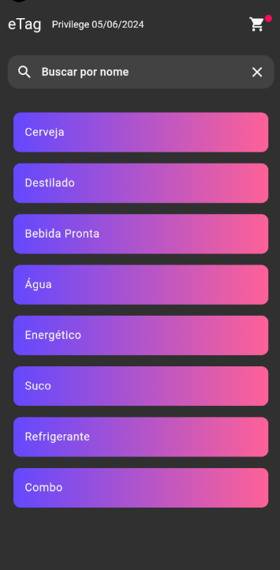
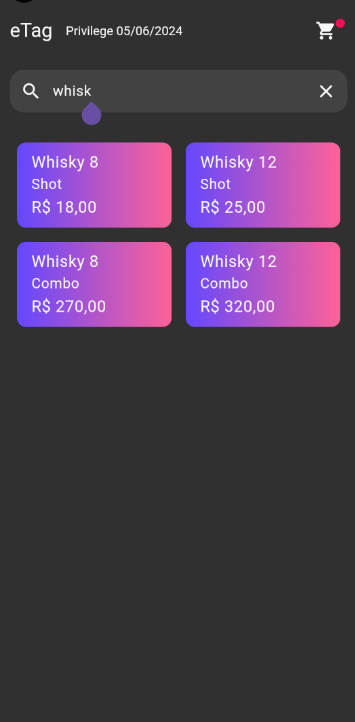
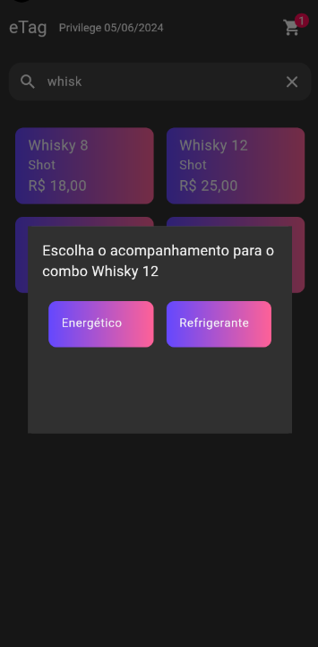
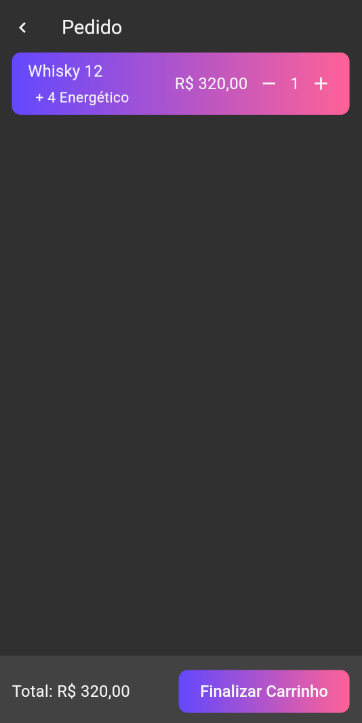

# eTag

O eTag é um aplicativo desenvolvido para facilitar a compra de bebidas em baladas e eventos. Ele permite que os usuários selecionem suas bebidas, imprime fichas correspondentes e soma os valores das compras. 

## Descrição das funcionalidades do eTag:

Seleção de Pedidos: Os usuários podem selecionar para os clientes diferentes bebidas e quantidades através da interface do aplicativo. A lista de bebidas disponíveis é apresentada com preços, facilitando a escolha.

Impressão de Fichas: Após a seleção das bebidas, o aplicativo imprime uma ficha contendo os detalhes do pedido. Esta ficha serve como um comprovante para que o usuário possa retirar as bebidas no bar.

Cálculo do Total: O eTag soma automaticamente o valor total das bebidas selecionadas. O total é exibido para o cliente antes da confirmação do pedido, garantindo transparência e evitando surpresas na hora do pagamento.

Armazenamento Local: Para garantir que o sistema funcione mesmo sem conexão à internet, o eTag utiliza armazenamento local. As informações dos pedidos são armazenadas no dispositivo, permitindo que o aplicativo funcione de maneira eficiente e rápida, mesmo offline.

O eTag é projetado para melhorar a experiência do usuário em eventos, tornando o processo de compra de bebidas mais ágil e organizado, evitando filas  e agilizando o atendimento no bar.

## Offline First no Flutter

O conceito de "Offline First" utiliza armazenamento local, permitindo que informações obtidas da internet (como uma requisição de API) sejam armazenadas no dispositivo. Dessa forma, quando o usuário estiver sem conexão (ou até mesmo para evitar múltiplas requisições desnecessárias), ele ainda poderá acessar rapidamente para atender a demanda dos clientes ao utilizar certas funcionalidades.

Ao escolher um banco de dados local e adequado, como SqFlite porque suporta e permite criar banco de dados relacionado. Onde esses dados servirá como armazenamento para os dados do seu aplicativo.

Um grande benefício de trabalhar offline é a capacidade de realizar uma limpeza precisa nos dados desatualizados. Isso assegura um uso mínimo de armazenamento. Além disso, a função de limpeza de cache permite que os dados sejam atualizados a partir do servidor, garantindo que seu aplicativo permaneça sincronizado com as informações mais recentes.

### Fotos

